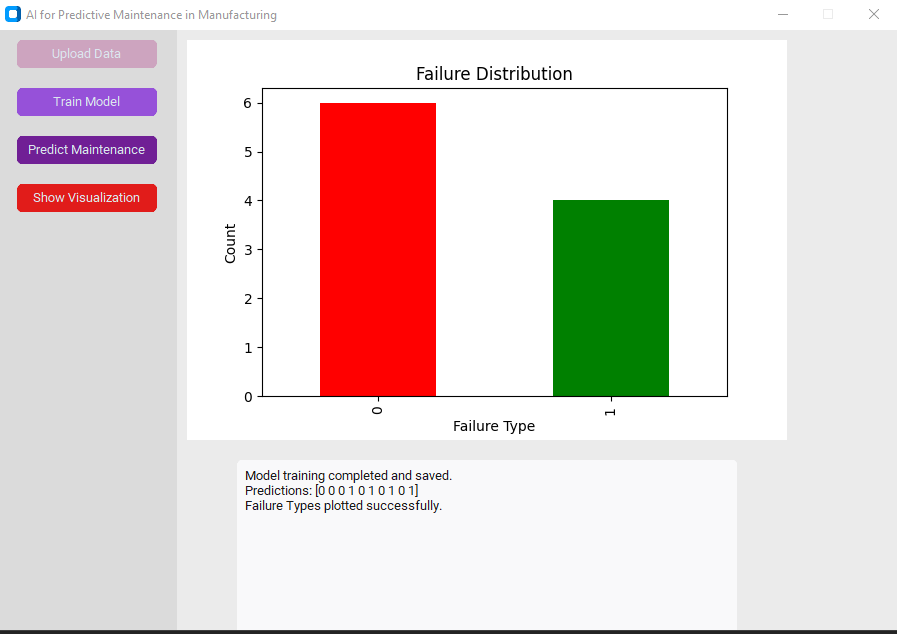

# Predictive Maintenance in Manufacturing

AI-driven application for predictive maintenance in manufacturing. The app helps monitor machine performance and predicts potential failures, enabling timely maintenance and minimizing downtime. The application leverages machine learning models to analyze historical data and predict equipment failures.

## Features

- **Upload Data:** Upload historical machine performance data for analysis.
- **Train Model:** Train the predictive maintenance model using the uploaded data.
- **Predict Maintenance:** Predict the likelihood of a machine failure based on trained models.
- **Show Visualization:** Display the failure distribution and success/failure rates with interactive visualizations.

## Requirements

### Python Libraries
The following Python libraries are required to run the application:

- `pandas` - for data manipulation and analysis.
- `matplotlib` - for creating plots and visualizations.
- `scikit-learn` - for machine learning model training.
- `customtkinter` - for building the user interface.
- `tkinter` - for the core Tkinter GUI framework.
- `numpy` - for numerical operations.

### Installation

1. **Clone the Repository**
   Clone this repository to your local machine:
```bash
   git clone https://github.com/kayung-developer/AI-Predictive-Maintenance.git
   cd AI-Predictive-Maintenance
```

2. **Set Up Virtual Environment** (Optional but Recommended) It's a good practice to create a virtual environment for managing dependencies:
```bash
python -m venv venv
source venv/bin/activate  # On Windows, use `venv\Scripts\activate`
```
3. **Install Required Libraries** Install the required libraries using pip:
```bash
pip install -r requirements.txt
```

4. **Run the Application** Start the application with the following command:
```bash
python main.py
```


### Usage
1. Upload Data
- Click on the "Upload Data" button to upload historical machine performance data in a CSV format. The dataset should include machine performance metrics like failure indicators, operational hours, etc.
2. Train Model
- After uploading the data, click the "Train Model" button to train the predictive maintenance model. The model will analyze the data and create a predictive model for failure predictions.
3. Predict Maintenance
- Once the model is trained, click the "Predict Maintenance" button to predict potential maintenance needs. The prediction will tell you whether the machine is likely to fail in the near future or remain operational.
4. Show Visualization
- To visualize the failure and success rates, click the "Show Visualization" button. This will display a chart showing the distribution of machine failures, allowing for better insights into failure trends and operational efficiency


### Directory Structure
```bash
ai-predictive-maintenance/
│
├── data/                # Folder for storing uploaded data
│   └── example_data.csv # Example dataset (optional)
│
├── main.py              # Main application file
├── requirements.txt     # Required Python packages
└── README.md            # This README file
```

### Example Dataset
To test the application, you can use the following sample dataset:

## Example Dataset

To test the application, you can use the following sample dataset:

| Machine   | Failure  | Time_to_failure |
|-----------|----------|-----------------|
| Machine 1 | Failure  | 30              |
| Machine 2 | Success  | 200             |
| Machine 3 | Failure  | 45              |
| Machine 4 | Failure  | 50              |
| Machine 5 | Success  | 100             |

**Note:** The `Failure` column should contain values such as `Failure` or `Success` indicating the state of the machine.


#### Visualization Example
The "Show Visualization" button generates one of the following charts:

- Failure Distribution (Bar Chart): Displays the number of `Failure` vs `Success` entries.
- Success vs Failure (Pie Chart): Shows the proportion of `Failure` and `Success` as a pie chart.


### Contributing
We welcome contributions to the project! If you have any improvements, bug fixes, or features to add, feel free to fork the repository and create a pull request.

1. Fork the repository.
2. Create your branch (git checkout -b feature/your-feature).
3. Commit your changes (git commit -am 'Add your feature').
4. Push to the branch (git push origin feature/your-feature).
5. Create a new pull request.


### License
- This project is licensed under the GNU General Public License - see the <a href="https://github.com/kayung-developer/AI-Predictive-Maintenance/blob/main/LICENSE">LICENSE</a> file for details.

### Acknowledgments
- This application leverages machine learning algorithms from scikit-learn to make predictions.
- The application uses matplotlib for visualizations and customtkinter for the user interface, making it visually appealing and user-friendly.

## Application Screenshot

Here is a screenshot of the AI-powered Predictive Maintenance application:



